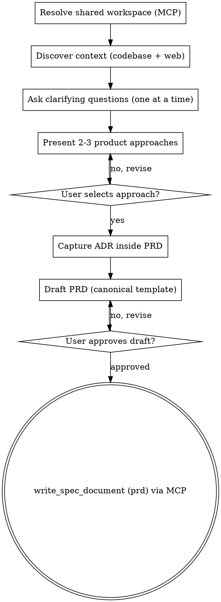

# Create PRD

Create a business-focused Product Requirements Document through structured brainstorming.

<HARD-GATE>
Do NOT write the PRD file until ALL phases are complete and the user has approved the final draft.
Do NOT skip the research phase — every PRD MUST be enriched with codebase and market context.
Do NOT skip user interactions — the user MUST participate in shaping the PRD at every decision point.
Do NOT require section-by-section approval — generate the complete draft, then let the user review it.
This applies to EVERY PRD regardless of perceived simplicity.
</HARD-GATE>

## Asking Questions

When this skill instructs you to ask the user a question, you MUST use your runtime's dedicated interactive question tool — the tool or function that presents a question to the user and **pauses execution until the user responds**. Do not output questions as plain assistant text and continue generating; always use the mechanism that blocks until the user has answered.

If your runtime does not provide such a tool, present the question as your complete message and stop generating. Do not answer your own question or proceed without user input.

## Anti-Pattern: "This Feature Is Too Simple For Full Brainstorming"

Every PRD goes through the full brainstorming process. A single button, a minor workflow tweak, a configuration option — all of them. "Simple" features are where unexamined business assumptions cause the most rework. The brainstorming can be brief for genuinely simple features, but you MUST ask clarifying questions and get approval on the product approach before writing the artifact.

## Anti-Pattern: End-Of-Flow Bureaucracy

Once the user has answered the clarifying questions and approved an approach, do not force them through a second approval loop for Overview, Goals, User Stories, or any other final document section. Synthesize the approved direction into the PRD directly. The user can review and request edits in the generated file afterward.

## Anti-Pattern: Technical Drift On Technical-Sounding Features

When the feature name sounds technical (e.g., "webhook notifications", "CSV export", "dark mode", "API rate limiting"), you will be tempted to discuss HOW to implement it. Resist this. Your job is the WHAT and WHY:

- WRONG: "Should we use WebSockets or polling for notifications?" (implementation)
- WRONG: "What CSV library format should we target?" (implementation)
- RIGHT: "Which events should trigger a notification to the user?" (user need)
- RIGHT: "What information do users need in their exported reports?" (user need)

Translate every technical-sounding feature into the user experience question behind it.

## Required Inputs

- Feature name or product idea.
- Optional: existing `_idea.md` file as primary input for context.
- Optional: existing `_prd.md` file for update mode.

## Checklist

You MUST create a task for each phase and complete them in order:

1. **Resolve shared workspace** — derive slug, resolve/create the `SpecWorkspace` in Mem0 Shared via MCP (`list_spec_workspaces` / `create_spec_workspace`)
2. **Discover context** — parallel codebase exploration and web research
3. **Understand the need** — ask 3-6 targeted questions to refine scope and intent
4. **Present product approaches** — offer 2-3 approaches with trade-offs, capture the chosen one as an ADR (embedded in the PRD's decision section)
5. **Draft the PRD** — write using the canonical template from `references/prd-template.md`
6. **Review with user** — present the draft, iterate until approved
7. **Save via MCP** — persist the PRD with `write_spec_document` (document_type="prd") — never a local `_prd.md`

## Workflow

1. Resolve the shared spec workspace (Mem0 Shared, via MCP — ADR-002).
   - Derive the slug from the feature name provided by the user.
   - Determine the `project_id` (the current project/repo name; use "default" if none is clearly defined).
   - Call `list_spec_workspaces(project_id=<project>)` to check whether a workspace with this slug already exists.
     - If it exists, operate in **update mode**: call `read_spec_document(workspace_id, document_type="prd")` to load the current content and version.
     - If it does not exist, call `create_spec_workspace(project_id=<project>, slug=<slug>, name=<feature name>)` (idempotent by project_id+slug) and keep the returned `workspace_id`.
   - If an `_idea.md` was provided as input, read it as primary context (input only — the PRD itself is persisted via MCP, not to disk).
   - **Do NOT create any `.docs/tasks/<slug>/` directory or local files.** The shared workspace is the single source of truth (ADR-002).
   - If any MCP tool returns an error (service unavailable, connection failure), STOP and report the failure clearly to the user — do NOT fall back to writing local files (ADR-002/ADR-007).

2. Discover context through parallel research. You MUST perform BOTH tracks before asking any questions.

   **Track A — Codebase exploration** (REQUIRED):
   - Search the codebase for files, patterns, and features related to the user's request.
   - Look for existing implementations, data models, and integration points that are relevant.
   - Summarize what you found in 3-5 bullet points.

   **Track B — Market and user research** (REQUIRED):
   - Perform 3-5 web searches for market trends, competitive products, and user needs related to the feature.
   - Look for how similar products solve this problem and what users expect.
   - Summarize what you found in 3-5 bullet points.

   Run both tracks in parallel (e.g., two Agent tool calls, two search batches, etc.). Present a brief merged summary of findings from BOTH tracks to the user before moving to questions. If web search tools are unavailable, note the limitation explicitly and proceed with codebase findings only.

3. Ask clarifying questions following `references/question-protocol.md` **in PT-BR**.
   - Focus exclusively on WHAT features users need, WHY it provides business value, and WHO the target users are.
   - Ask about success criteria and constraints.
   - Never ask technical implementation questions about databases, APIs, frameworks, or architecture.
   - **ONE question per message — strictly enforced.** Your message must contain exactly one question mark. After asking the question, STOP. Do not add follow-up questions, "also" questions, or "additionally" prompts. If a topic needs more exploration, ask a follow-up in the NEXT message after the user responds.

     Anti-pattern (FORBIDDEN):
     "What is the primary user persona? Also, what are the key success metrics?"
     This is TWO questions. Split them into two separate messages.

   - Every question MUST be multiple-choice when reasonable options can be predetermined. Format as labeled options (A, B, C, etc.) so the user can respond with a single letter. Only use open-ended questions when the answer space is genuinely unbounded (e.g., "What problem are you trying to solve?").
   - Include a fallback option (e.g., "D) Other — describe") for flexibility.
   - For complex features with many dimensions, decompose into sub-topics and ask about one dimension at a time. Each sub-topic usually has predeterminable options. Example: instead of the open-ended "What should the collaboration feature include?", ask "Which aspect of team collaboration is most important to start with? A) Shared workspaces B) Real-time presence C) Permission controls D) Activity feeds".
   - Complete at least one full clarification round before presenting approaches.

4. Present product approaches.
   - Offer 2-3 product approaches with trade-offs for each.
   - Lead with the recommended approach and explain why it is preferred.
   - Wait for the user to select an approach before continuing.
   - After the user selects an approach, capture an ADR for this decision **inside the PRD** (the shared space persists documents by type; there is no separate ADR store):
     - Read `references/adr-template.md` for the ADR structure.
     - Number ADRs sequentially within this PRD (adr-001, adr-002, ...).
     - Fill the template in **PT-BR**: the selected approach as "Decisão", rejected approaches as "Alternativas Consideradas" with their trade-offs, and outcomes as "Consequências". Set Status to "Aceito" and Date to today.
     - Append the full ADR text to the PRD's "Registros de Decisão de Arquitetura" section (step 5) — do NOT write any `adrs/*.md` local file.

5. Draft the PRD.
   - After the user selects an approach, synthesize the final product design. Do not present each section for separate approval.
   - If the user makes a significant scope decision during clarification or approach selection, create an additional ADR following the same process as step 4.
   - Only pause before writing if a blocking ambiguity remains that would force guessing; otherwise proceed directly to document generation.
   - Read `references/prd-template.md` and fill every section with gathered context.
   - Include a "Registros de Decisão de Arquitetura" section containing the **full text** of every ADR captured during this session (numbered adr-001, adr-002, ...), since the shared space stores the PRD as a single document (no separate `adrs/` files).
   - Apply YAGNI ruthlessly: challenge every feature and remove anything the MVP does not need.
   - The PRD must describe user capabilities and business outcomes only.
   - No databases, APIs, code structure, frameworks, testing strategies, or architecture decisions.
   - Mandatory sections (ALWAYS include): Visão Geral, Objetivos, Histórias de Usuário, Funcionalidades Principais, Experiência do Usuário, Fora de Escopo, Plano de Entrega por Fases, Métricas de Sucesso, Riscos e Mitigações, Registros de Decisão de Arquitetura, Perguntas em Aberto.
   - Optional sections (include when relevant): Restrições Técnicas de Alto Nível.
   - Prefer active voice, omit needless words, use definite and specific language over vague generalities. Every sentence should earn its place.
   - Language: **PT-BR** (português brasileiro). Tone: claro, técnico, consistente com os artefatos do projeto.
   - Present the complete draft to the user for review.

6. Review with the user.
   - Present the draft and ask using the interactive question tool (in PT-BR):
     - "Segue o rascunho do PRD. Revise e informe:"
     - A) Aprovado — salvar como está
     - B) Ajustar seções específicas (indique quais)
     - C) Reescrever a seção X (diga o que mudar)
     - D) Descartar e recomeçar
   - If B or C: make the changes and present again.
   - If D: go back to step 3.

7. Save the PRD via MCP (only after the HARD-GATE approval in step 6).
   - Persist the approved document with `write_spec_document(workspace_id=<workspace>, document_type="prd", content=<PRD>, expected_version=<version>)`.
     - On first write of a new workspace, pass `expected_version=null`.
     - In update mode, pass the `current_version` returned by the `read_spec_document` in step 1 (or the latest read).
   - **Conflict handling:** if the tool returns `conflict=true`, the document changed since you read it. Do NOT overwrite. Inform the user (in PT-BR) that another writer updated the PRD, show the `current_version`, re-read the current content, reconcile your changes onto it, and only then retry `write_spec_document` with the new `current_version`.
   - **Service unavailability:** if the tool call errors (MCP/Mem0 Shared down), STOP and report the failure clearly to the user. Do NOT write a local `_prd.md` as a fallback (ADR-002/ADR-007).
   - On success, confirm to the user (in PT-BR) the shared workspace (project + slug) and the new document version where the PRD was saved.
   - Remind the user (in PT-BR) that the next step is to create a TechSpec using `cy-create-techspec` from this PRD.

## Process Flow

## Error Handling

- If the user provides insufficient context to complete a section, note it in Perguntas em Aberto rather than guessing.
- If web research tools are unavailable, proceed with codebase exploration only and note the limitation.
- If the MCP tools (Mem0 Shared) are unavailable, stop and report the failure clearly — do NOT write a local `_prd.md` fallback (ADR-002/ADR-007).
- If `write_spec_document` returns `conflict=true`, do not overwrite: re-read the current version, reconcile, and retry with the current version.
- If operating in update mode, preserve sections the user has not asked to change.

## Key Principles

- **One question at a time** — Do not overwhelm with multiple questions in a single message
- **Multiple choice mandatory** — Every question MUST be multiple-choice (A/B/C) when options can be predetermined; open-ended only when the answer space is genuinely unbounded
- **YAGNI ruthlessly** — Challenge every feature; remove anything the MVP does not need
- **Draft then review** — Get approval on the product approach, generate the complete draft, then iterate with the user until approved
- **Business focus only** — Never ask about implementation; that belongs in TechSpec
- **Idea as input** — When `_idea.md` exists, use it as primary context to accelerate brainstorming
- **Pipeline awareness** — The PRD feeds into `cy-create-techspec`; focus on WHAT and WHY, not HOW
- **Template compliance** — Every PRD MUST follow the canonical template
- **Language consistency** — Write all artifacts and user-facing messages in PT-BR (see Language Policy below)

## Language Policy — PT-BR

**Todos** os artefatos e interações desta skill são em **português brasileiro (PT-BR)**:

| Artefato | Destino |
|----------|---------|
| Ideia (se fornecida como entrada) | `_idea.md` (somente leitura de contexto) |
| PRD | Mem0 Shared via `write_spec_document` (document_type="prd") |
| ADRs | seção "Registros de Decisão de Arquitetura" dentro do PRD |

Regras:
- Títulos de seção, narrativa, listas e tabelas em português
- Perguntas ao usuário, resumos de pesquisa e prompts de revisão em PT-BR
- Termos técnicos consagrados no repositório podem permanecer em inglês (ex.: API, webhook, middleware)
- Status em ADRs: `Proposto`, `Aceito`, `Depreciado`, `Substituído por ADR-XXX`
- Use os modelos em `references/` (já em PT-BR)
