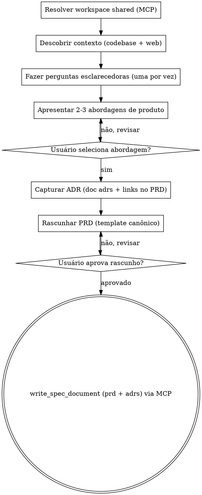

# Criar PRD

Crie um Documento de Requisitos de Produto orientado ao negócio por meio de brainstorming estruturado.

<HARD-GATE>
NÃO escreva o arquivo do PRD até que TODAS as fases estejam concluídas e o usuário tenha aprovado o rascunho final.
NÃO pule a fase de pesquisa — todo PRD DEVE ser enriquecido com contexto de codebase e mercado.
NÃO pule as interações com o usuário — o usuário DEVE participar da construção do PRD em cada ponto de decisão.
NÃO exija aprovação seção por seção — gere o rascunho completo e deixe o usuário revisá-lo.
Isso se aplica a TODO PRD, independentemente da simplicidade percebida.
**KANBAN:** Após cada etapa significativa (criação do workspace, salvamento do PRD, mudança de status), atualize o quadro/workspace ShareMem via MCP na MESMA interação. Nunca deixe o progresso apenas no chat. Consulte `references/kanban-shared-obrigatorio.md`.
</HARD-GATE>

## Quadro Kanban Shared (obrigatório)

O SpecWorkspace / Documentações no ShareMem é a fonte de verdade da equipe. Em **cada** atividade desta skill:

1. Resolver/criar o workspace com `list_spec_workspaces` / `create_spec_workspace`.
2. Ao gravar o PRD aprovado, usar `write_spec_document` (prd) e, se houver ADRs, **também** `write_spec_document` (document_type="adrs") com o texto completo — confirmar project+slug+versões ao usuário.
3. Manter o status do workspace coerente com `update_spec_workspace_status` (`planejamento` enquanto só há PRD; `ativo` quando a implementação/TechSpec já avançou no mesmo workspace).
4. Se houver cards no quadro e a atividade os afetar, atualizar com `claim_task` / `update_task_status` / `add_spec_comment` — nunca só narrar no chat. Pipeline obrigatório: `em_andamento` → `revisao_codigo` → `fase_teste` → `concluido` (sem pular).

Ler e seguir `references/kanban-shared-obrigatorio.md` antes de concluir qualquer fase.

## Fazer Perguntas

Quando esta skill instruir você a fazer uma pergunta ao usuário, você DEVE usar a ferramenta dedicada de pergunta interativa do seu runtime — a ferramenta ou função que apresenta uma pergunta ao usuário e **pausa a execução até que o usuário responda**. Não emita perguntas como texto simples do assistente e continue gerando; sempre use o mecanismo que bloqueia até o usuário ter respondido.

Se o seu runtime não fornecer tal ferramenta, apresente a pergunta como sua mensagem completa e pare de gerar. Não responda sua própria pergunta nem prossiga sem entrada do usuário.

## Anti-Padrão: "Esta Feature É Simples Demais Para Brainstorming Completo"

Todo PRD passa pelo processo completo de brainstorming. Um único botão, um pequeno ajuste de fluxo, uma opção de configuração — todos eles. Features "simples" são onde premissas de negócio não examinadas causam mais retrabalho. O brainstorming pode ser breve para features genuinamente simples, mas você DEVE fazer perguntas esclarecedoras e obter aprovação na abordagem de produto antes de escrever o artefato.

## Anti-Padrão: Burocracia no Final do Fluxo

Depois que o usuário tiver respondido às perguntas esclarecedoras e aprovado uma abordagem, não o force a passar por um segundo ciclo de aprovação para Visão Geral, Objetivos, Histórias de Usuário ou qualquer outra seção final do documento. Sintetize a direção aprovada diretamente no PRD. O usuário pode revisar e solicitar edições no arquivo gerado depois.

## Anti-Padrão: Deriva Técnica em Features de Nome Técnico

Quando o nome da feature soa técnico (ex.: "webhook notifications", "CSV export", "dark mode", "API rate limiting"), você será tentado a discutir COMO implementá-la. Resista a isso. Seu trabalho é o O QUÊ e o POR QUÊ:

- ERRADO: "Devemos usar WebSockets ou polling para notificações?" (implementação)
- ERRADO: "Qual formato de biblioteca CSV devemos adotar?" (implementação)
- CERTO: "Quais eventos devem disparar uma notificação para o usuário?" (necessidade do usuário)
- CERTO: "Quais informações os usuários precisam nos relatórios exportados?" (necessidade do usuário)

Traduza toda feature de nome técnico na pergunta de experiência do usuário por trás dela.

## Entradas Obrigatórias

- Nome da feature ou ideia de produto.
- Opcional: arquivo `_idea.md` existente como entrada principal de contexto.
- Opcional: arquivo `_prd.md` existente para modo de atualização.

## Checklist

Você DEVE criar uma tarefa para cada fase e completá-las em ordem:

1. **Resolver workspace shared** — derivar slug, resolver/criar o `SpecWorkspace` no ShareMem via MCP (`list_spec_workspaces` / `create_spec_workspace`)
2. **Descobrir contexto** — exploração paralela da codebase e pesquisa web
3. **Entender a necessidade** — fazer 3-6 perguntas direcionadas para refinar escopo e intenção
4. **Apresentar abordagens de produto** — oferecer 2-3 abordagens com trade-offs, capturar a escolhida como ADR (texto completo no documento `adrs` + links no PRD)
5. **Rascunhar o PRD** — escrever usando o template canônico de `references/prd-template.md`
6. **Revisar com o usuário** — apresentar o rascunho, iterar até aprovação
7. **Salvar via MCP** — persistir o PRD (`document_type="prd"`) **e** o documento de ADRs (`document_type="adrs"`) — nunca `_prd.md` / `adrs/*.md` locais

## Fluxo de Trabalho

1. Resolver o spec workspace shared (ShareMem, via MCP — ADR-002).
   - Derivar o slug a partir do nome da feature fornecido pelo usuário.
   - Determinar o `project_id` (nome do projeto/repositório atual; use "default" se nenhum estiver claramente definido).
   - Chamar `list_spec_workspaces(slug=<slug>)` para procurar o workspace globalmente antes de filtrar por projeto ou criar.
     - Se houver exatamente um resultado, usá-lo e operar em **modo de atualização**: chamar `read_spec_document(workspace_id, document_type="prd")` e `read_spec_document(workspace_id, document_type="adrs")`.
     - Se houver múltiplos resultados, pedir ao usuário para escolher o workspace correto.
     - Se não houver resultado, chamar `create_spec_workspace(project_id=<project>, slug=<slug>, name=<feature name>)` e manter o `workspace_id` retornado.
   - Se um `_idea.md` foi fornecido como entrada, lê-lo como contexto principal (somente entrada — o PRD em si é persistido via MCP, não em disco).
   - **NÃO criar nenhum diretório `.docs/tasks/<slug>/` nem arquivos locais.** O workspace shared é a única fonte de verdade (ADR-002).
   - Se qualquer ferramenta MCP retornar erro (serviço indisponível, falha de conexão), PARAR e reportar a falha claramente ao usuário — NÃO recorrer a escrever arquivos locais (ADR-002/ADR-007).
   - **Gravar a memória-ponteiro (obrigatório quando o workspace é criado).** Ver `references/ponteiro-de-spec.md`. Em resumo: `add_memories` com as coordenadas do workspace (`project_id`, `slug`, `workspace_id`) em **cada** projeto mem0 onde alguém vai trabalhar — sobretudo quando a feature toca repositórios cujo nome de diretório é **diferente** do `project_id` do workspace. Sem isso a spec fica indescobrível para quem não a criou, porque `search_memory` e `search_specs` não alcançam workspaces em andamento de outro projeto.
   - Se a feature for **multi-repositório**, perguntar ao usuário quais repositórios serão tocados antes de gravar os ponteiros (uma pergunta, múltipla escolha com `multiSelect`), e gravar um ponteiro por repositório.

2. Descobrir contexto por meio de pesquisa paralela. Você DEVE executar TODAS as três trilhas antes de fazer qualquer pergunta.

   **Trilha A — Exploração da codebase** (OBRIGATÓRIA):
   - Buscar na codebase arquivos, padrões e features relacionados ao pedido do usuário.
   - Procurar implementações existentes, modelos de dados e pontos de integração relevantes.
   - Resumir o que encontrou em 3-5 bullet points.

   **Trilha B — Pesquisa de mercado e usuário** (OBRIGATÓRIA):
   - Realizar 3-5 buscas web sobre tendências de mercado, produtos concorrentes e necessidades dos usuários relacionados à feature.
   - Procurar como produtos similares resolvem este problema e o que os usuários esperam.
   - Resumir o que encontrou em 3-5 bullet points.

   **Trilha C — Histórico de Especificações** (OBRIGATÓRIA):
   - Chamar `search_specs(query="<termos chave da feature>", statuses=["*"])` para buscar PRDs, TechSpecs e ADRs já existentes no servidor MCP que tenham relação com o requisito atual.
   - Ler e identificar possíveis sobreposições, dependências ou lições aprendidas a partir das especificações anteriores.
   - Resumir as descobertas relevantes.

   Executar as trilhas em paralelo (ex.: múltiplas chamadas de ferramentas). Apresentar um breve resumo mesclado dos achados ao usuário antes de seguir para as perguntas. Se ferramentas de busca web estiverem indisponíveis, anotar a limitação explicitamente e prosseguir com as demais.

3. Fazer perguntas esclarecedoras seguindo `references/question-protocol.md` **em PT-BR**.
   - Focar exclusivamente em QUAIS features os usuários precisam, POR QUE isso gera valor de negócio e QUEM são os usuários-alvo.
   - Perguntar sobre critérios de sucesso e restrições.
   - Nunca fazer perguntas técnicas de implementação sobre bancos de dados, APIs, frameworks ou arquitetura.
   - **UMA pergunta por mensagem — estritamente aplicado.** Sua mensagem deve conter exatamente um ponto de interrogação. Depois de fazer a pergunta, PARAR. Não adicionar perguntas de follow-up, perguntas "também" ou prompts "adicionalmente". Se um tópico precisar de mais exploração, fazer um follow-up na PRÓXIMA mensagem após a resposta do usuário.

     Anti-padrão (PROIBIDO):
     "Qual é a persona principal do usuário? Também, quais são as métricas-chave de sucesso?"
     Isso são DUAS perguntas. Dividi-las em duas mensagens separadas.

   - Toda pergunta DEVE ser de múltipla escolha quando opções razoáveis puderem ser predeterminadas. Formatar como opções rotuladas (A, B, C, etc.) para que o usuário possa responder com uma única letra. Usar perguntas abertas apenas quando o espaço de resposta for genuinamente ilimitado (ex.: "Qual problema você está tentando resolver?").
   - Incluir uma opção de fallback (ex.: "D) Outro — descreva") para flexibilidade.
   - Para features complexas com muitas dimensões, decompor em sub-tópicos e perguntar sobre uma dimensão por vez. Cada sub-tópico geralmente tem opções predetermináveis. Exemplo: em vez da pergunta aberta "O que a feature de colaboração deve incluir?", perguntar "Qual aspecto da colaboração em equipe é mais importante para começar? A) Workspaces compartilhados B) Presença em tempo real C) Controles de permissão D) Feeds de atividade".
   - Completar pelo menos uma rodada completa de esclarecimento antes de apresentar abordagens.

4. Apresentar abordagens de produto.
   - Oferecer 2-3 abordagens de produto com trade-offs para cada uma.
   - Liderar com a abordagem recomendada e explicar por que é preferida.
   - Aguardar o usuário selecionar uma abordagem antes de continuar.
   - Depois que o usuário selecionar uma abordagem, capturar um ADR para esta decisão e **subir no documento shared `adrs`** (ADRs não são cards Kanban):
     - Ler `references/adr-template.md` para a estrutura do ADR.
     - Numerar ADRs sequencialmente no workspace (adr-001, adr-002, …), continuando após o maior número já presente em `read_spec_document(..., "adrs")` e/ou na seção de ADRs do PRD.
     - Preencher o template em **PT-BR**: a abordagem selecionada como "Decisão", abordagens rejeitadas como "Alternativas Consideradas" com seus trade-offs, e resultados como "Consequências". Definir Status como "Aceito" e Date como hoje.
     - Guardar o texto completo (`### ADR-NNN: Título` + Status/Data/Contexto/Decisão/Alternativas/Consequências) para gravar em `document_type="adrs"` no passo 7.
     - No PRD, na seção "Registros de Decisão de Arquitetura", listar links markdown `[ADR-NNN: Título](adrs/adr-NNN.md)` (a UI Shared abre o doc `adrs`). Pode incluir um resumo de uma linha; o texto completo SoT é o documento `adrs`. **NÃO** escrever arquivos locais `adrs/*.md`.

5. Rascunhar o PRD.
   - Depois que o usuário selecionar uma abordagem, sintetizar o design final de produto. Não apresentar cada seção para aprovação separada.
   - Se o usuário tomar uma decisão significativa de escopo durante o esclarecimento ou seleção de abordagem, criar um ADR adicional seguindo o mesmo processo do passo 4.
   - Pausar antes de escrever apenas se restar uma ambiguidade bloqueante que force adivinhação; caso contrário, prosseguir diretamente para a geração do documento.
   - Ler `references/prd-template.md` e preencher cada seção com o contexto coletado.
   - Incluir uma seção "Registros de Decisão de Arquitetura" com links `[ADR-NNN: Título](adrs/adr-NNN.md)` para cada ADR desta sessão (e anteriores do workspace). O texto completo vai no documento MCP `adrs`.
   - Aplicar YAGNI rigorosamente: questionar cada feature e remover tudo que o MVP não precisa.
   - O PRD deve descrever apenas capacidades do usuário e resultados de negócio.
   - Sem bancos de dados, APIs, estrutura de código, frameworks, estratégias de teste ou decisões de arquitetura.
   - Seções obrigatórias (SEMPRE incluir): Visão Geral, Objetivos, Histórias de Usuário, Funcionalidades Principais, Experiência do Usuário, Fora de Escopo, Plano de Entrega por Fases, Métricas de Sucesso, Riscos e Mitigações, Registros de Decisão de Arquitetura, Perguntas em Aberto.
   - **Tolerância Zero a Lacunas:** NENHUMA pergunta/dúvida levantada na especificação pode ficar em aberto sem passar pelo usuário. Você não deve inventar respostas ou completar informações por conta própria. A seção "Perguntas em Aberto" só pode conter itens que o usuário explicitamente pediu para adiar.
   - Seções opcionais (incluir quando relevante): Restrições Técnicas de Alto Nível.
   - Preferir voz ativa, omitir palavras desnecessárias, usar linguagem definida e específica em vez de generalidades vagas. Cada frase deve merecer seu lugar.
   - Idioma: **PT-BR** (português brasileiro). Tom: claro, técnico, consistente com os artefatos do projeto.
   - Apresentar o rascunho completo ao usuário para revisão.

6. Revisar com o usuário.
   - Apresentar o rascunho e perguntar usando a ferramenta de pergunta interativa (em PT-BR):
     - "Segue o rascunho do PRD. Revise e informe:"
     - A) Aprovado — salvar como está
     - B) Ajustar seções específicas (indique quais)
     - C) Reescrever a seção X (diga o que mudar)
     - D) Descartar e recomeçar
   - Se B ou C: fazer as alterações e apresentar novamente.
   - Se D: voltar ao passo 3.

7. Salvar o PRD e os ADRs via MCP (somente após a aprovação HARD-GATE no passo 6).
   - Persistir o PRD com `write_spec_document(workspace_id=<workspace>, document_type="prd", content=<PRD>, expected_version=<version>)`.
     - Na primeira gravação de um workspace novo, passar `expected_version=null`.
     - No modo de atualização, passar o `current_version` retornado pelo `read_spec_document` no passo 1 (ou a leitura mais recente).
   - **OBRIGATÓRIO — documento `adrs`:** na mesma interação, gravar (ou atualizar) o documento de ADRs com `write_spec_document(workspace_id, document_type="adrs", content=<todos os ADRs do workspace em markdown>, expected_version=<versão adrs|null>)`. Incluir o texto completo de cada ADR (`### ADR-NNN: ...`). Alias `adr` também é aceito. ADRs **não** são TaskCards.
   - **Tratamento de conflito:** se a ferramenta retornar `conflict=true`, o documento mudou desde que você o leu. NÃO sobrescrever. Informar o usuário (em PT-BR) que outro autor atualizou o documento, mostrar o `current_version`, reler o conteúdo atual, reconciliar suas alterações sobre ele e só então tentar novamente `write_spec_document` com o novo `current_version`.
   - **Indisponibilidade do serviço:** se a chamada da ferramenta falhar (MCP/ShareMem fora do ar), PARAR e reportar a falha claramente ao usuário. NÃO escrever um `_prd.md` local como fallback (ADR-002/ADR-007).
   - Em caso de sucesso, confirmar ao usuário (em PT-BR) o workspace shared (project + slug) e as novas versões de `prd` e `adrs`.
   - Garantir que o lifecycle do workspace reflita o planejamento: se ainda houver apenas PRD, `update_spec_workspace_status(workspace_id, "planejamento")` quando ainda não estiver definido.
   - Lembrar o usuário (em PT-BR) que o próximo passo é criar uma TechSpec usando `cy-create-techspec` a partir deste PRD — e que o quadro Shared deve permanecer sincronizado a cada atividade.

## Fluxo do Processo

```dot
digraph create_prd {
    "Resolver workspace shared (MCP)" [shape=box];
    "Descobrir contexto (codebase + web)" [shape=box];
    "Fazer perguntas esclarecedoras (uma por vez)" [shape=box];
    "Apresentar 2-3 abordagens de produto" [shape=box];
    "Usuário seleciona abordagem?" [shape=diamond];
    "Capturar ADR (doc adrs + links no PRD)" [shape=box];
    "Rascunhar PRD (template canônico)" [shape=box];
    "Usuário aprova rascunho?" [shape=diamond];
    "write_spec_document (prd + adrs) via MCP" [shape=doublecircle];

    "Resolver workspace shared (MCP)" -> "Descobrir contexto (codebase + web)";
    "Descobrir contexto (codebase + web)" -> "Fazer perguntas esclarecedoras (uma por vez)";
    "Fazer perguntas esclarecedoras (uma por vez)" -> "Apresentar 2-3 abordagens de produto";
    "Apresentar 2-3 abordagens de produto" -> "Usuário seleciona abordagem?";
    "Usuário seleciona abordagem?" -> "Apresentar 2-3 abordagens de produto" [label="não, revisar"];
    "Usuário seleciona abordagem?" -> "Capturar ADR (doc adrs + links no PRD)" [label="sim"];
    "Capturar ADR (doc adrs + links no PRD)" -> "Rascunhar PRD (template canônico)";
    "Rascunhar PRD (template canônico)" -> "Usuário aprova rascunho?";
    "Usuário aprova rascunho?" -> "Rascunhar PRD (template canônico)" [label="não, revisar"];
    "Usuário aprova rascunho?" -> "write_spec_document (prd + adrs) via MCP" [label="aprovado"];
}
```

## Tratamento de Erros

- Se o usuário fornecer contexto insuficiente para completar uma seção, pergunte a ele. NÃO complete informações por conta própria e não deixe dúvidas não resolvidas na seção "Perguntas em Aberto" sem o aval do usuário.
- Se ferramentas de pesquisa web estiverem indisponíveis, prosseguir apenas com a exploração da codebase e anotar a limitação.
- Se as ferramentas MCP (ShareMem) estiverem indisponíveis, parar e reportar a falha claramente — NÃO escrever um fallback local `_prd.md` (ADR-002/ADR-007).
- Se `write_spec_document` retornar `conflict=true`, não sobrescrever: reler a versão atual, reconciliar e tentar novamente com a versão atual.
- Se operando em modo de atualização, preservar seções que o usuário não pediu para alterar.

## Princípios-Chave

- **Uma pergunta por vez** — Não sobrecarregar com múltiplas perguntas em uma única mensagem
- **Múltipla escolha obrigatória** — Toda pergunta DEVE ser de múltipla escolha (A/B/C) quando opções puderem ser predeterminadas; aberta apenas quando o espaço de resposta for genuinamente ilimitado
- **YAGNI rigoroso** — Questionar cada feature; remover tudo que o MVP não precisa
- **Rascunho e depois revisão** — Obter aprovação na abordagem de produto, gerar o rascunho completo e iterar com o usuário até aprovação
- **Foco no negócio apenas** — Nunca perguntar sobre implementação; isso pertence à TechSpec
- **Ideia como entrada** — Quando `_idea.md` existir, usá-lo como contexto principal para acelerar o brainstorming
- **Consciência do pipeline** — O PRD alimenta `cy-create-techspec`; focar no O QUÊ e no POR QUÊ, não no COMO
- **Conformidade com template** — Todo PRD DEVE seguir o template canônico
- **Consistência de idioma** — Escrever todos os artefatos e mensagens ao usuário em PT-BR (consulte Política de Idioma abaixo)
- **Kanban sempre ativo** — Após cada atividade significativa, o quadro/workspace Shared DEVE já refleti-la (consulte `references/kanban-shared-obrigatorio.md`)

## Política de Idioma — PT-BR

**Todos** os artefatos e interações desta skill são em **português brasileiro (PT-BR)**:

| Artefato | Destino |
|----------|---------|
| Ideia (se fornecida como entrada) | `_idea.md` (somente leitura de contexto) |
| PRD | ShareMem via `write_spec_document` (document_type="prd") |
| ADRs | ShareMem via `write_spec_document` (document_type="adrs"); PRD só com links `adrs/adr-NNN.md` |

Regras:
- Títulos de seção, narrativa, listas e tabelas em português
- Perguntas ao usuário, resumos de pesquisa e prompts de revisão em PT-BR
- Termos técnicos consagrados no repositório podem permanecer em inglês (ex.: API, webhook, middleware)
- Status em ADRs: `Proposto`, `Aceito`, `Depreciado`, `Substituído por ADR-XXX`
- Use os modelos em `references/` (já em PT-BR)
