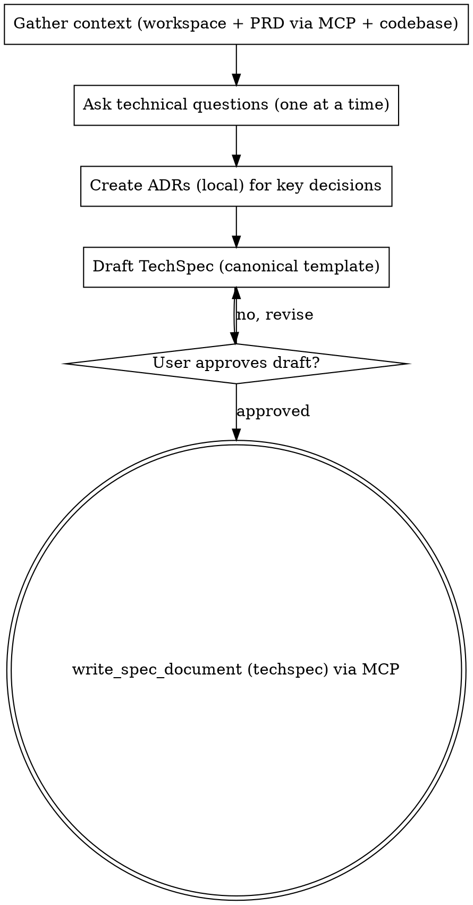

# Create TechSpec

Translate business requirements into a detailed technical specification.

<HARD-GATE>
Do NOT write the TechSpec file until ALL phases are complete and the user has approved the final draft.
Do NOT skip the codebase exploration — every TechSpec MUST be informed by existing architecture.
Do NOT skip user interactions — the user MUST participate in shaping the TechSpec at every decision point.
Do NOT require section-by-section approval — generate the complete draft, then let the user review it.
This applies to EVERY TechSpec regardless of perceived simplicity.
</HARD-GATE>

## Asking Questions

When this skill instructs you to ask the user a question, you MUST use your runtime's dedicated interactive question tool — the tool or function that presents a question to the user and **pauses execution until the user responds**. Do not output questions as plain assistant text and continue generating; always use the mechanism that blocks until the user has answered.

If your runtime does not provide such a tool, present the question as your complete message and stop generating. Do not answer your own question or proceed without user input.

## Anti-Pattern: "This Is Too Simple To Need Technical Design Review"

Every TechSpec goes through the full design review process. A single endpoint, a minor refactor, a configuration change — all of them. "Simple" technical changes are where unexamined assumptions about existing architecture cause the most integration failures. The design review can be brief for genuinely simple changes, but you MUST ask technical clarification questions and get approval on the technical approach before writing the artifact.

## Anti-Pattern: End-Of-Flow Bureaucracy

Once the user has answered the technical clarification questions and approved an approach, do not force them through a second approval loop for System Architecture, Data Models, API Design, or other final document sections. Synthesize the approved direction into the TechSpec directly. The user can review and request edits in the generated file afterward.

## Required Inputs

- Feature name identifying the `.docs/tasks/<name>/` directory.
- Optional: existing `_prd.md` as primary input.
- Optional: existing `_techspec.md` for update mode.

## Checklist

You MUST create a task for each phase and complete them in order:

1. **Gather context** — resolve the shared workspace, read the PRD via MCP (`read_spec_document`), read local ADRs, and explore codebase architecture
2. **Ask technical questions** — 3-6 targeted questions on architecture, data models, APIs, testing
3. **Create ADRs** — record significant technical decisions (ADRs stay **local** in `adrs/` in this MVP — see note in step 3)
4. **Draft the TechSpec** — write using the canonical template from `references/techspec-template.md`
5. **Review with user** — present the draft, iterate until approved
6. **Save via MCP** — persist the TechSpec with `write_spec_document` (document_type="techspec") — never a local `_techspec.md`

## Workflow

1. Gather context (PRD/TechSpec via MCP — ADR-002).
   - Derive the slug from the feature name; determine the `project_id` (project/repo name, "default" if none).
   - Call `list_spec_workspaces(project_id=<project>)` to resolve the workspace for this slug. If it does not exist, call `create_spec_workspace(project_id, slug, name)` and keep the `workspace_id`.
   - Read the PRD via `read_spec_document(workspace_id, document_type="prd")`.
     - If a PRD is found, use it as the primary input.
     - **Standalone mode:** if no PRD is found (`found=false`), ask the user for a description of what needs technical specification — do NOT fail.
   - Read the current TechSpec via `read_spec_document(workspace_id, document_type="techspec")`; if found, operate in **update mode** and keep its `current_version` for the write.
   - **ADRs remain LOCAL in this MVP:** read existing ADRs from `.docs/tasks/<name>/adrs/` and create that directory if needed. The PRD/TechSpec are persisted remotely via MCP, but ADRs are out of the remote-versioning scope of the MVP PRD (see step 3).
   - Spawn an Agent tool call to explore the codebase for architecture patterns, existing components, dependencies, and technology stack.
   - If any MCP tool errors (service unavailable), STOP and report clearly — do NOT read/write local `_prd.md`/`_techspec.md` as a fallback (ADR-002/ADR-007).

2. Ask technical clarification questions **in PT-BR**.
   - Focus on HOW to implement, WHERE components live, and WHICH technologies to use.
   - Cover architecture approach and component boundaries.
   - Cover data models and storage choices.
   - Cover API design and integration points.
   - Cover testing strategy and performance requirements.
   - Ask only one question per message. If a topic needs more exploration, break it into a sequence of individual questions.
   - Prefer multiple-choice questions when the options can be predetermined.
   - Include a fallback option (e.g., "D) Other — describe") for flexibility.

3. Create ADRs for significant technical decisions.
   - **MVP scope note (ADR-002):** ADRs are intentionally kept as **local files** in `.docs/tasks/<name>/adrs/`. Remote versioning via MCP covers the PRD and the TechSpec only; ADRs are out of the remote-versioning scope of the MVP PRD. Do not attempt to persist ADRs via `write_spec_document`.
   - For each significant decision (architecture pattern chosen, technology selected, data model approach, etc.):
     - Read `references/adr-template.md`.
     - Determine the next ADR number by listing existing files in `.docs/tasks/<name>/adrs/`.
     - Fill the template in **PT-BR**: the chosen design as "Decisão", rejected alternatives as "Alternativas Consideradas", and trade-offs as "Consequências". Set Status to "Aceito" and Date to today.
     - Write each ADR to `.docs/tasks/<name>/adrs/adr-NNN.md` (zero-padded 3-digit sequential number).

4. Draft the TechSpec.
   - Read `references/techspec-template.md` and fill every applicable section.
   - **MANDATORY — Registros de Decisão de Arquitetura section:** The generated TechSpec MUST end with a "Registros de Decisão de Arquitetura" section listing every ADR created during this process. Each entry must include the ADR number (e.g., ADR-001), title, and a one-line summary in PT-BR formatted as a link to the `adrs/` directory. Even simple features require at least one ADR documenting the primary technical approach chosen and alternatives rejected. If no ADRs were created in step 3, go back and create at least one before generating the document.
   - Apply YAGNI ruthlessly: remove any component, interface, or abstraction that is not strictly necessary. Do NOT propose new packages or directories when the feature can be implemented by adding a single file to an existing package.
   - Every PRD goal and user story should map to a technical component.
   - Reference PRD sections by name but do not duplicate business context.
   - Include code examples only for core interfaces, limited to 20 lines each. The Core Interfaces section must contain at least one Go interface or struct definition as a code block, even for simple features — show the primary type that other components will depend on.
   - The Development Sequencing section MUST include a numbered Build Order where every step after the first explicitly states which previous steps it depends on.
   - Prefer active voice, omit needless words, use definite and specific language over vague generalities. Every sentence should earn its place.
   - Language: **PT-BR** (português brasileiro). Tone: claro, técnico, consistente com os artefatos do projeto.
   - Present the complete draft to the user for review.

5. Review with the user.
   - Present the draft and ask using the interactive question tool (in PT-BR):
     - "Segue o rascunho do TechSpec. Revise e informe:"
     - A) Aprovado — salvar como está
     - B) Ajustar seções específicas (indique quais)
     - C) Reescrever a seção X (diga o que mudar)
     - D) Descartar e recomeçar
   - If B or C: make the changes and present again.
   - If D: go back to step 2.

6. Save the TechSpec via MCP (only after the HARD-GATE approval in step 5).
   - Persist the approved document with `write_spec_document(workspace_id=<workspace>, document_type="techspec", content=<TechSpec>, expected_version=<version>)`.
     - On first write, pass `expected_version=null`.
     - In update mode, pass the `current_version` returned by `read_spec_document` in step 1.
   - **Conflict handling:** if the tool returns `conflict=true`, do NOT overwrite. Inform the user (PT-BR), show `current_version`, re-read the current content, reconcile, and retry with the new `current_version`.
   - **Service unavailability:** if the tool call errors (Mem0 Shared down), STOP and report clearly. Do NOT write a local `_techspec.md` fallback (ADR-002/ADR-007).
   - On success, confirm to the user (PT-BR) the shared workspace (project + slug) and the new document version.
   - Remind the user (in PT-BR) that the next step is to create tasks using `cy-create-tasks` from this TechSpec.

## Process Flow

## Error Handling

- If no PRD is found via `read_spec_document` (standalone mode), proceed with user-provided context and note the absence in the Resumo Executivo — do NOT fail.
- If the MCP tools (Mem0 Shared) are unavailable, stop and report clearly — do NOT read/write local `_prd.md`/`_techspec.md` fallback (ADR-002/ADR-007).
- If `write_spec_document` returns `conflict=true`, do not overwrite: re-read the current version, reconcile, and retry with the current version.
- If codebase exploration reveals conflicting architectural patterns, document both and recommend one with rationale.
- If the user rejects the design proposal, incorporate all feedback and present a revised proposal.
- If operating in update mode, preserve sections the user has not asked to change.

## Key Principles

- **One question at a time** — Do not overwhelm with multiple questions in a single message
- **Multiple choice preferred** — Easier for users to answer than open-ended when possible
- **YAGNI ruthlessly** — Remove unnecessary components, abstractions, and interfaces from all designs
- **Draft then review** — Generate the complete TechSpec draft first, then iterate with the user until approved
- **Technical focus only** — Never ask business questions; that belongs in the PRD
- **Trade-offs are mandatory** — Every Resumo Executivo must state the primary technical trade-off of the chosen approach (in PT-BR)
- **PRD as input** — When `_prd.md` exists, use it as primary context; every PRD goal should map to a technical component
- **Pipeline awareness** — The TechSpec feeds into `cy-create-tasks`; focus on HOW, not WHAT or WHY
- **Template compliance** — Every TechSpec MUST follow the canonical template
- **Language consistency** — Write all artifacts and user-facing messages in PT-BR (see Language Policy below)

## Language Policy — PT-BR

**Todos** os artefatos e interações desta skill são em **português brasileiro (PT-BR)**:

| Artefato | Destino |
|----------|---------|
| PRD (entrada) | Mem0 Shared via `read_spec_document` (document_type="prd") |
| TechSpec | Mem0 Shared via `write_spec_document` (document_type="techspec") |
| ADRs | `adrs/adr-NNN.md` (local — fora do escopo remoto no MVP) |

Regras:
- Perguntas técnicas ao usuário, rascunhos e prompts de revisão em PT-BR
- Ao referenciar o PRD, use os nomes de seção como aparecem no documento (em português)
- Prosa do TechSpec em português; comentários em exemplos de código podem ser em PT-BR
- Termos técnicos consagrados no repositório podem permanecer em inglês
- Status em ADRs: `Proposto`, `Aceito`, `Depreciado`, `Substituído por ADR-XXX`
- Use os modelos em `references/` (já em PT-BR)
