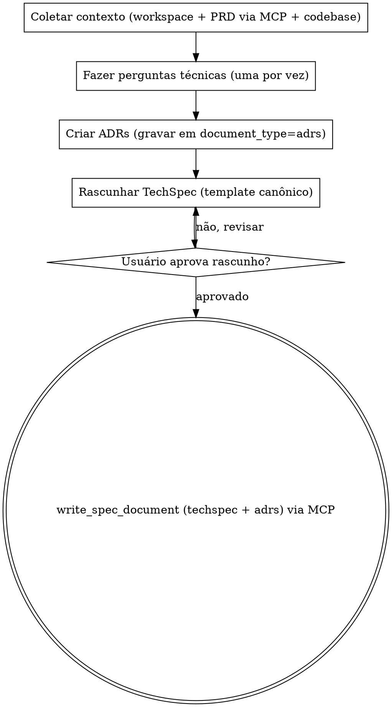

# Criar TechSpec

Traduza requisitos de negócio em uma especificação técnica detalhada.

<HARD-GATE>
NÃO escreva o arquivo da TechSpec até que TODAS as fases estejam concluídas e o usuário tenha aprovado o rascunho final.
NÃO pule a exploração da codebase — toda TechSpec DEVE ser informada pela arquitetura existente.
NÃO pule as interações com o usuário — o usuário DEVE participar da construção da TechSpec em cada ponto de decisão.
NÃO exija aprovação seção por seção — gere o rascunho completo e deixe o usuário revisá-lo.
Isso se aplica a TODA TechSpec, independentemente da simplicidade percebida.
**KANBAN:** Após cada etapa significativa (resolução do workspace, salvamento da TechSpec, status do workspace), atualize o quadro ShareMem via MCP na MESMA interação. Nunca deixe o progresso apenas no chat. Consulte `../cy-create-prd/references/kanban-shared-obrigatorio.md`.
</HARD-GATE>

## Quadro Kanban Shared (obrigatório)

O SpecWorkspace no ShareMem é a fonte de verdade. Em **cada** atividade desta skill:

1. Resolver o workspace via MCP antes de redigir.
2. Ao gravar a TechSpec aprovada (`write_spec_document` techspec **e** `write_spec_document` adrs), atualizar o lifecycle: `update_spec_workspace_status(workspace_id, "ativo")` quando o design técnico estiver aprovado e o trabalho seguir (ou confirmar se já estiver `ativo`).
3. Se já existirem `TaskCard`s e esta sessão os afetar, usar `claim_task` / `update_task_status` / `add_spec_comment` — não narrar progresso só no chat. Respeitar o pipeline `em_andamento` → `revisao_codigo` → `fase_teste` → `concluido` (nunca pular review ou testes).
4. Seguir `../cy-create-prd/references/kanban-shared-obrigatorio.md` antes de encerrar qualquer fase.

## Fazer Perguntas

Quando esta skill instruir você a fazer uma pergunta ao usuário, você DEVE usar a ferramenta dedicada de pergunta interativa do seu runtime — a ferramenta ou função que apresenta uma pergunta ao usuário e **pausa a execução até que o usuário responda**. Não emita perguntas como texto simples do assistente e continue gerando; sempre use o mecanismo que bloqueia até o usuário ter respondido.

Se o seu runtime não fornecer tal ferramenta, apresente a pergunta como sua mensagem completa e pare de gerar. Não responda sua própria pergunta nem prossiga sem entrada do usuário.

## Anti-Padrão: "Isso É Simples Demais Para Revisão de Design Técnico"

Toda TechSpec passa pelo processo completo de revisão de design. Um único endpoint, um pequeno refactor, uma mudança de configuração — todos eles. Mudanças técnicas "simples" são onde premissas não examinadas sobre a arquitetura existente causam mais falhas de integração. A revisão de design pode ser breve para mudanças genuinamente simples, mas você DEVE fazer perguntas de esclarecimento técnico e obter aprovação na abordagem técnica antes de escrever o artefato.

## Anti-Padrão: Burocracia no Final do Fluxo

Depois que o usuário tiver respondido às perguntas de esclarecimento técnico e aprovado uma abordagem, não o force a passar por um segundo ciclo de aprovação para Arquitetura do Sistema, Modelos de Dados, Design de API ou outras seções finais do documento. Sintetize a direção aprovada diretamente na TechSpec. O usuário pode revisar e solicitar edições no arquivo gerado depois.

## Entradas Obrigatórias

- Nome da feature, do qual se deriva o **slug** do `SpecWorkspace` (não um diretório local).
- `project_id` (nome do projeto/repositório atual; "default" se nenhum estiver claramente definido).
- O PRD e a TechSpec vêm do workspace via `read_spec_document` — **não** de arquivos locais. O modo de atualização é detectado pela existência do documento `techspec` no workspace, não por um `_techspec.md` em disco.

## Checklist

Você DEVE criar uma tarefa para cada fase e completá-las em ordem:

1. **Coletar contexto** — resolver o workspace shared, ler PRD/TechSpec/`adrs` via MCP (`read_spec_document`), extrair ADRs existentes e explorar a arquitetura da codebase
2. **Fazer perguntas técnicas** — 3-6 perguntas direcionadas sobre arquitetura, modelos de dados, APIs, testes
3. **Criar ADRs** — registrar decisões técnicas significativas (texto completo será gravado em `document_type="adrs"` — nunca arquivos locais `adrs/*.md`)
4. **Rascunhar a TechSpec** — escrever usando o template canônico de `references/techspec-template.md`
5. **Revisar com o usuário** — apresentar o rascunho, iterar até aprovação
6. **Salvar via MCP** — persistir TechSpec (`techspec`) **e** ADRs (`adrs`) — nunca um `_techspec.md` local

## Fluxo de Trabalho

1. Coletar contexto (PRD/TechSpec via MCP — ADR-002).
   - Derivar o slug a partir do nome da feature; determinar o `project_id` (nome do projeto/repositório, "default" se nenhum).
   - Chamar `list_spec_workspaces(slug=<slug>)` para resolver o workspace globalmente. Se houver exatamente um resultado, usá-lo; se houver múltiplos, pedir ao usuário para escolher; se não houver, chamar `create_spec_workspace(project_id, slug, name)`.
     - **Se você criou o workspace aqui**, gravar a memória-ponteiro conforme `../cy-create-prd/references/ponteiro-de-spec.md`.
     - Não criar workspace duplicado apenas porque a busca filtrada pelo projeto atual voltou vazia.
   - Ler o PRD via `read_spec_document(workspace_id, document_type="prd")`.
     - Se um PRD for encontrado, usá-lo como entrada principal.
     - **Modo standalone:** se nenhum PRD for encontrado (`found=false`), perguntar ao usuário uma descrição do que precisa de especificação técnica — NÃO falhar.
   - Ler a TechSpec atual via `read_spec_document(workspace_id, document_type="techspec")`; se encontrada, operar em **modo de atualização** e manter seu `current_version` para a gravação.
   - Ler ADRs via `read_spec_document(workspace_id, document_type="adrs")` (alias `adr`). Fonte de verdade do texto completo dos ADRs. Também extrair qualquer ADR legado ainda embutido no PRD/TechSpec. **NÃO** ler ou escrever `.docs/tasks/<name>/adrs/*.md` — arquivos locais são legado.
   - Disparar uma chamada Agent tool para explorar a codebase em busca de padrões de arquitetura, componentes existentes, dependências e stack tecnológica.
   - Se qualquer ferramenta MCP falhar (serviço indisponível), PARAR e reportar claramente — NÃO ler/escrever `_prd.md`/`_techspec.md` locais como fallback (ADR-002/ADR-007).

2. Fazer perguntas de esclarecimento técnico **em PT-BR**.
   - Focar em COMO implementar, ONDE os componentes ficam e QUAIS tecnologias usar.
   - Cobrir abordagem de arquitetura e limites de componentes.
   - Cobrir modelos de dados e escolhas de armazenamento.
   - Cobrir design de API e pontos de integração.
   - Cobrir estratégia de testes e requisitos de performance.
   - Fazer apenas uma pergunta por mensagem. Se um tópico precisar de mais exploração, dividi-lo em uma sequência de perguntas individuais.
   - Preferir perguntas de múltipla escolha quando as opções puderem ser predeterminadas.
   - Incluir uma opção de fallback (ex.: "D) Outro — descreva") para flexibilidade.

3. Criar ADRs para decisões técnicas significativas.
   - **Regra do espaço shared:** ADRs **não** são TaskCards. Texto completo vive no documento MCP `document_type="adrs"`. TechSpec/PRD só referenciam com links `[ADR-NNN: Título](adrs/adr-NNN.md)`. **NÃO** escrever `.docs/tasks/<name>/adrs/adr-NNN.md` nem qualquer arquivo ADR local.
   - Para cada decisão significativa (padrão de arquitetura escolhido, tecnologia selecionada, abordagem de modelo de dados, etc.):
     - Ler `references/adr-template.md`.
     - Determinar o próximo número de ADR continuando após o ADR mais alto já presente no documento `adrs` e/ou PRD/TechSpec (3 dígitos com zero à esquerda, ex.: se termina em ADR-006, começar em ADR-007).
     - Preencher o template em **PT-BR**: o design escolhido como "Decisão", alternativas rejeitadas como "Alternativas Consideradas" e trade-offs como "Consequências". Definir Status como "Aceito" e Date como hoje.
     - Manter o texto completo do ADR pronto para mesclar no documento `adrs` no passo 6.

4. Rascunhar a TechSpec.
   - Ler `references/techspec-template.md` e preencher cada seção aplicável.
   - **OBRIGATÓRIO — seção Registros de Decisão de Arquitetura:** A TechSpec DEVE terminar com uma seção "Registros de Decisão de Arquitetura" listando links `[ADR-NNN: Título](adrs/adr-NNN.md)` para todo ADR técnico criado (e ponteiros aos ADRs de produto no doc `adrs` / PRD). O texto completo SoT é gravado em `document_type="adrs"` — **não** deixe ADRs só embutidos na TechSpec sem subir o documento `adrs`. Mesmo features simples exigem pelo menos um ADR. Se nenhum ADR foi criado no passo 3, voltar e criar pelo menos um antes de gerar o documento.
   - Aplicar YAGNI rigorosamente: remover qualquer componente, interface ou abstração que não seja estritamente necessária. NÃO propor novos pacotes ou diretórios quando a feature puder ser implementada adicionando um único arquivo a um pacote existente.
   - Todo objetivo e história de usuário do PRD deve mapear para um componente técnico.
   - Referenciar seções do PRD pelo nome, mas não duplicar contexto de negócio.
   - Incluir exemplos de código apenas para interfaces principais, limitados a 20 linhas cada. A seção Core Interfaces deve conter pelo menos uma definição de interface ou struct Go como bloco de código, mesmo para features simples — mostrar o tipo principal do qual outros componentes dependerão.
   - A seção Development Sequencing DEVE incluir um Build Order numerado onde cada passo após o primeiro declara explicitamente de quais passos anteriores depende.
   - **Fidelidade Absoluta:** O agente DEVE trabalhar estritamente dentro das especificações. NÃO complete informações técnicas por conta própria ou tome decisões silenciosas se a TechSpec for omissa. Pergunte ao usuário. Toda dúvida técnica deve ser resolvida antes do rascunho final.
   - Preferir voz ativa, omitir palavras desnecessárias, usar linguagem definida e específica em vez de generalidades vagas. Cada frase deve merecer seu lugar.
   - Idioma: **PT-BR** (português brasileiro). Tom: claro, técnico, consistente com os artefatos do projeto.
   - Apresentar o rascunho completo ao usuário para revisão.

5. Revisar com o usuário.
   - Apresentar o rascunho e perguntar usando a ferramenta de pergunta interativa (em PT-BR):
     - "Segue o rascunho do TechSpec. Revise e informe:"
     - A) Aprovado — salvar como está
     - B) Ajustar seções específicas (indique quais)
     - C) Reescrever a seção X (diga o que mudar)
     - D) Descartar e recomeçar
   - Se B ou C: fazer as alterações e apresentar novamente.
   - Se D: voltar ao passo 2.

6. Salvar a TechSpec e os ADRs via MCP (somente após a aprovação HARD-GATE no passo 5).
   - Persistir a TechSpec com `write_spec_document(workspace_id=<workspace>, document_type="techspec", content=<TechSpec>, expected_version=<version>)`.
     - Na primeira gravação, passar `expected_version=null`.
     - No modo de atualização, passar o `current_version` retornado por `read_spec_document` no passo 1.
   - **OBRIGATÓRIO — documento `adrs`:** na mesma interação, mesclar os ADRs novos/atualizados no conteúdo completo do workspace e gravar com `write_spec_document(workspace_id, document_type="adrs", content=<ADRs>, expected_version=<versão adrs|null>)`. Alias `adr` aceito. Sem isso, os links nos specs não têm destino no servidor.
   - **Tratamento de conflito:** se a ferramenta retornar `conflict=true`, NÃO sobrescrever. Informar o usuário (PT-BR), mostrar `current_version`, reler o conteúdo atual, reconciliar e tentar novamente com o novo `current_version`.
   - **Indisponibilidade do serviço:** se a chamada da ferramenta falhar (ShareMem fora do ar), PARAR e reportar claramente. NÃO escrever um `_techspec.md` local como fallback (ADR-002/ADR-007).
   - Em caso de sucesso, confirmar ao usuário (PT-BR) o workspace shared (project + slug) e as novas versões de `techspec` e `adrs`.
   - Sincronizar o quadro: chamar `update_spec_workspace_status(workspace_id, "ativo")` para que a lista Kanban/workspace mostre trabalho técnico em andamento (idempotente se já estiver `ativo`).
   - Lembrar o usuário (PT-BR) que o próximo passo é criar tarefas usando `cy-create-tasks` a partir desta TechSpec — e que **cada** atividade seguinte deve atualizar o quadro Shared.

## Fluxo do Processo

```dot
digraph create_techspec {
    "Coletar contexto (workspace + PRD via MCP + codebase)" [shape=box];
    "Fazer perguntas técnicas (uma por vez)" [shape=box];
    "Criar ADRs (gravar em document_type=adrs)" [shape=box];
    "Rascunhar TechSpec (template canônico)" [shape=box];
    "Usuário aprova rascunho?" [shape=diamond];
    "write_spec_document (techspec + adrs) via MCP" [shape=doublecircle];

    "Coletar contexto (workspace + PRD via MCP + codebase)" -> "Fazer perguntas técnicas (uma por vez)";
    "Fazer perguntas técnicas (uma por vez)" -> "Criar ADRs (gravar em document_type=adrs)";
    "Criar ADRs (gravar em document_type=adrs)" -> "Rascunhar TechSpec (template canônico)";
    "Rascunhar TechSpec (template canônico)" -> "Usuário aprova rascunho?";
    "Usuário aprova rascunho?" -> "Rascunhar TechSpec (template canônico)" [label="não, revisar"];
    "Usuário aprova rascunho?" -> "write_spec_document (techspec + adrs) via MCP" [label="aprovado"];
}
```

## Tratamento de Erros

- Se nenhum PRD for encontrado via `read_spec_document` (modo standalone), prosseguir com contexto fornecido pelo usuário e anotar a ausência no Resumo Executivo — NÃO falhar.
- Se as ferramentas MCP (ShareMem) estiverem indisponíveis, parar e reportar claramente — NÃO ler/escrever fallback local `_prd.md`/`_techspec.md` (ADR-002/ADR-007).
- Se `write_spec_document` retornar `conflict=true`, não sobrescrever: reler a versão atual, reconciliar e tentar novamente com a versão atual.
- Se a exploração da codebase revelar padrões arquiteturais conflitantes, documentar ambos e recomendar um com justificativa.
- Se o usuário rejeitar a proposta de design, incorporar todo o feedback e apresentar uma proposta revisada.
- Se operando em modo de atualização, preservar seções que o usuário não pediu para alterar.

## Princípios-Chave

- **Uma pergunta por vez** — Não sobrecarregar com múltiplas perguntas em uma única mensagem
- **Múltipla escolha preferida** — Mais fácil para os usuários responderem do que aberta quando possível
- **YAGNI rigoroso** — Remover componentes, abstrações e interfaces desnecessários de todos os designs
- **Rascunho e depois revisão** — Gerar o rascunho completo da TechSpec primeiro, depois iterar com o usuário até aprovação
- **Foco técnico apenas** — Nunca fazer perguntas de negócio; isso pertence ao PRD
- **Trade-offs são obrigatórios** — Todo Resumo Executivo deve declarar o trade-off técnico principal da abordagem escolhida (em PT-BR)
- **PRD como entrada** — Quando `_prd.md` existir, usá-lo como contexto principal; todo objetivo do PRD deve mapear para um componente técnico
- **Consciência do pipeline** — A TechSpec alimenta `cy-create-tasks`; focar no COMO, não no O QUÊ ou POR QUÊ
- **Conformidade com template** — Toda TechSpec DEVE seguir o template canônico
- **Consistência de idioma** — Escrever todos os artefatos e mensagens ao usuário em PT-BR (consulte Política de Idioma abaixo)
- **Kanban sempre ativo** — Após cada atividade significativa, o quadro/workspace Shared DEVE já refleti-la (`../cy-create-prd/references/kanban-shared-obrigatorio.md`)

## Política de Idioma — PT-BR

**Todos** os artefatos e interações desta skill são em **português brasileiro (PT-BR)**:

| Artefato | Destino |
|----------|---------|
| PRD (entrada) | ShareMem via `read_spec_document` (document_type="prd") |
| TechSpec | ShareMem via `write_spec_document` (document_type="techspec") |
| ADRs técnicos | ShareMem via `write_spec_document` (document_type="adrs"); TechSpec com links `adrs/adr-NNN.md` |

Regras:
- Perguntas técnicas ao usuário, rascunhos e prompts de revisão em PT-BR
- Ao referenciar o PRD, use os nomes de seção como aparecem no documento (em português)
- Prosa da TechSpec em português; comentários em exemplos de código podem ser em PT-BR
- Termos técnicos consagrados no repositório podem permanecer em inglês
- Status em ADRs: `Proposto`, `Aceito`, `Depreciado`, `Substituído por ADR-XXX`
- Use os modelos em `references/` (já em PT-BR)
